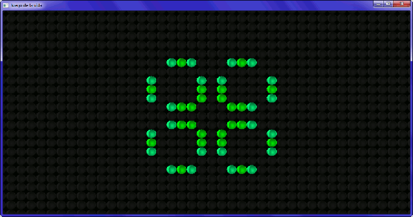
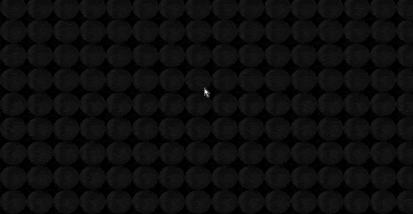
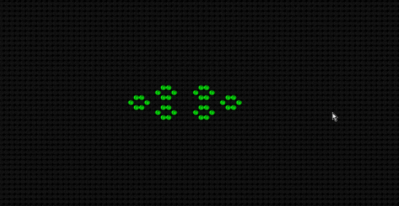
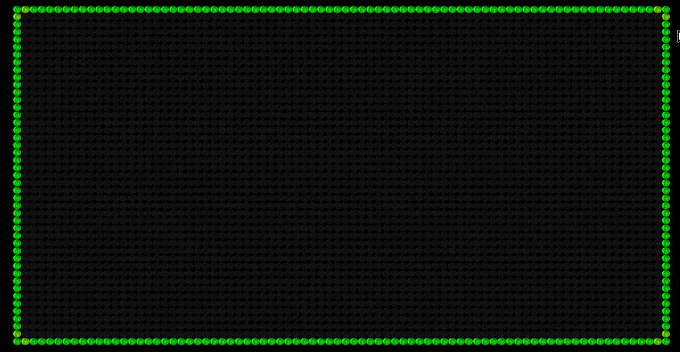

# Game_of_life
This is a C++ and SFML implementation of Conway's Game of Life algorithm.

In order to compile this program you need to install SFML 2.4.1 or above, for more information go to https://www.sfml-dev.org

The program has some basic controls like adding/deleting cells, camera zoom and panning, stop, play and next cycle.

## Images

